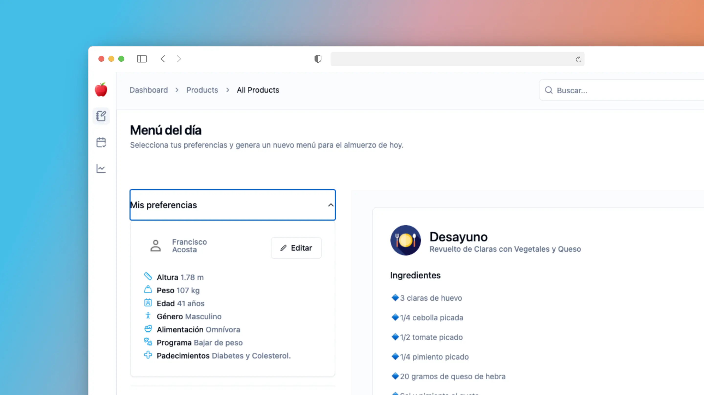
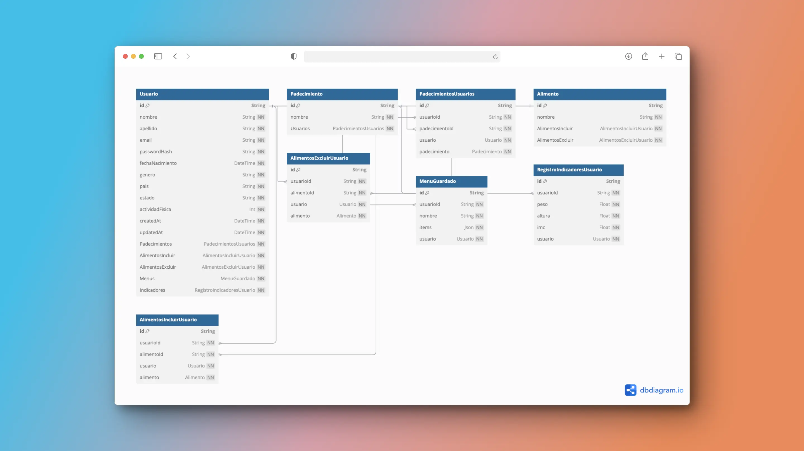

<h1 align="center"><strong>🍎What2Eat</strong></h1>
<h3 align="center"><strong>Dashboard administrativo</strong></h3>

<br />
<div align="center">
<a style="font-size: 18px" href="https://what2eat-dashboard.vercel.app/">Demo</a>
<span> · </span>
<a style="font-size: 18px" href="https://github.com/fconakuaz/what2eat-dashboard">Repositorio en Git</a>
 <span> · </span>
<a style="font-size: 18px" href="https://dbdiagram.io/d/What2Eat-679c125f263d6cf9a0952c89">Diagrama de la Base de datos</a>
 
</div>

<br>


 
<br>

## Características principales

- ✅ **Generación de menús inteligentes** con IA generativa del modelo de Gemini 2 Flash.
- ✅ **Compatibilidad con Google Fit** para ajustar tus menús según tu actividad física.
- ✅ **Personalización** para dietas especiales: vegetariana, sin gluten, alta en proteínas, etc.
- ✅ **Gestión eficiente de inventarios**: usa lo que tienes en tu despensa antes de que caduque.
- ✅ **Interfaz fácil de usar**, rápida y optimizada.
- ✅ **Multilingüe**, con soporte para varios idiomas (Español/Inglés).

<br>

## Estructura de Base de datos

<a style="font-size: 18px" href="https://dbdiagram.io/d/What2Eat-679c125f263d6cf9a0952c89">Diagrama de la Base de datos</a>

```plaintext
/
├── prisma/
│   ├── schema.prisma  (Modelos de BD)

```



<br>

## Estructura de archivos

```plaintext
/
├── app/
│   ├── (dashboard)/
│   ├── [locale]/
│   ├── AI/
│   ├── api/
│   ├── components/
│   ├── login/
│   ├── store/
│   ├── layout.tsx
│   ├── globals.css
│   ├── request.ts
│   ├── favicon.ico
├── components/
│   ├── dashboard/
│   ├── ui/
│   ├── icons.tsx
│   ├── theme-provider.tsx
├── i18n/
│   ├── request.ts
├── lib/
│   ├── auth.ts
│   ├── db.ts
│   ├── prisma.ts
│   ├── utils.ts
├── messages/
│   ├── en.json
│   ├── es.json
├── prisma/
│   ├── dbml/
│   ├── migrations/
│   ├── schema.prisma
│   ├── seed.ts
├── public/
│   ├── apple-touch-icon.png
│   ├── ...
├── .env
├── package.json
├── README.md
└── ...

```

## Tecnologías usadas

- Framework - [Next.js (App Router)](https://nextjs.org)
- Lenguaje - [TypeScript](https://www.typescriptlang.org)
- Auth - [Auth.js](https://authjs.dev)
- Base de datos - [Postgres](https://vercel.com/postgres)
- Deployment - [Vercel](https://vercel.com/docs/concepts/next.js/overview)
- Styling - [Tailwind CSS](https://tailwindcss.com)
- Componentes - [Shadcn UI](https://ui.shadcn.com/)
- Analytics - [Vercel Analytics](https://vercel.com/analytics)
- Formatting - [Prettier](https://prettier.io)
- ORM - [Prisma](https://www.prisma.io/)

## Getting Started

### Config BD with Prisma

Una vez configurada la url de la base de datos para conectar Prisma se realizan los siguientes pasos

```bash
# Crea tablas en BD
pnpm prisma migrate dev --name init

# Actualiza tablas en BD
pnpm prisma migrate dev --name update

# Generate tables cada que se hacen cambios al esquema
pnpm prisma generate

# Reset prisma si requieres borrar toda la BD de cero
pnpm prisma db push --force-reset

# Run seed
pnpm run seed
```

El archivo `.env.example` convertirlo a `.env` y actualizar los valores de las variables de ambiente.

Finalmente se corren los comandos del servidor de desarrollo:

```
pnpm install
pnpm run dev
```

Ahora podrás ver la aplicación lanzada en http://localhost:3000.

**Creado por [Francisco Nakú Acosta Zárate](#)**
